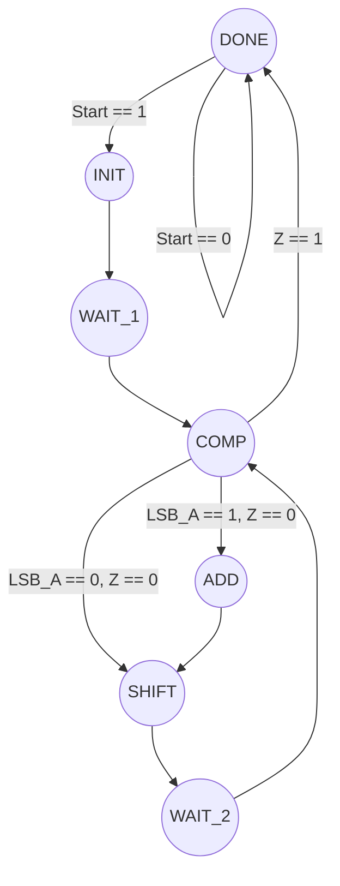

# FSM (Finite State Machine) script component template for SimulIDE

This is a script template for implementing FSMs (finite state Machines) in [SimulIDE](https://simulide.com/p/) by using mainly [Angel Script](https://www.angelcode.com/angelscript/) and the other SimulIDE's component files. 

As any other script component this is composed by 3 files:
- the package file: `FSM.package`
- the mcu file: `FSM.mcu`
- the script file: `FSM.as`

For details of implementing script components in SimulIDE you check the official [video](https://www.youtube.com/watch?v=vJLfuVwbvGE).

## Description 
This FSM template has 8 logic inputs, 8 logic outputs and supports up to 256 states.

### Inputs
You can read inputs using this syntax:
```cpp
input[<index>]
```
where `index` is from `0` to `7`

for example:
```cpp
if( input[0] == 1 )
{
    state = add_state;
}
```

Also you can define the input names (indexes) using the `enum` declaration provided:
```cpp
enum input_names
{
    A, 
    B,
}

if( input[A] == 1 )
{
    state = add_state;
}
```

### Outputs
You can assign the outputs using this syntax:
```cpp
output[<index>] = <value>

```
where `index` is from `0` to `7` and `value` can be `0` or `1`.

for example:
```cpp
output[3] == 1;
```

Also you can define the output names (indexes) using the `enum` declaration provided:
```cpp
enum output_names
{
    X, 
    Y,
    Z,
}

output[Z] == 1;
```

### States
You can define the state names (indexes) using the `enum` declaration provided:
```cpp
enum state_names
{
	state0,
	state1,
	state2,
}
```

You can also define the binary coding of each state:
```cpp
enum state_names
{
	state0 = 0b0000,
	state1 = 0b0010,
	state2 = 0b0100,
}
```

## Working

### Initial state
You must define the initial state in the `reset()` function:
```cpp
void reset() // Executed at Simulation start
{ 
	.
	.
	state = state0;		//====== INITIAL STATE ======//		
	.
	.
}
```

### State transitions and outputs
You must define the FSM working inside `voltChanged()` function, modifying each `case` of the `switch` sentence:
```cpp
void voltChanged()	// clock signal change
{	
	if( clk.getInpState() )	// if rising edge
	{	
		get_inputs();
		switch( state )		// select state
		{
			case state0:
				output[X] = 0;		// Output Logic
				output[Y] = 0;
				output[Z] = 0;
				if(input[A] == 1)	// Next State Logic
					state = state1;
				else if(input[B] == 1)
					state = state2;
				break;
				.
				.
				.
			default:
				state = state0;	
                break;
		}
		set_outputs();
	}
}
```

for each `case` you must define the _Output Logic_:
```cpp
	output[X] = 0;		// Output Logic
	output[Y] = 0;
	output[Z] = 0;
```

and the `Next State Logic`:
```cpp
	if(input[A] == 1)	// Next State Logic
		state = state1;
	else if(input[B] == 1)
		state = state2;
``` 

## This FSM example
The implemented Finite State Machine is a control block for a 4-bit sequential multiplier which corresponds to this state diagram:




