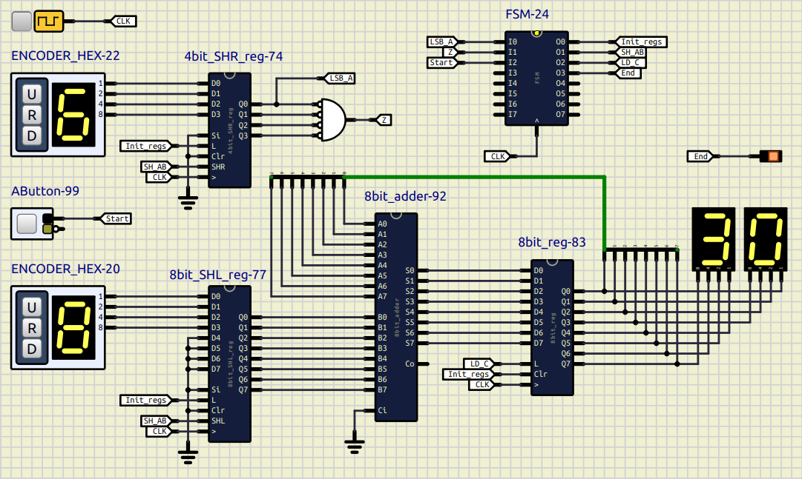

# Simulación de un multiplicador secuencial de 4 bits

Este ejemplo implementa una simulación de multiplicador secuencial digital de 4 bits en [SimulIDE](https://simulide.com/p/), está compuesto por:

- Registro de desplazamiento a la daerecha de entrada paralela de 4 bits (subcircuito)
- Registro de desplazamiento a la izquierda de entrada paralela de 4 bits y salida paralela de 8 bits (subcircuito)
- Registro de carga paralelo de 8 bits (subcircuito)
- Comparador de valor cero de 4 bits
- Sumador de 8 bits (subcircuito)
- FSM Máquina de estados finitos como bloque de control (script) [archivo leame](/FSM/README.md)

Pueden seguir el siguiente [tutorial](https://youtu.be/PAcU9CNJh7A?si=TVzpL2JlhtzKox_8).

Este se hace como ejemplo/plantilla para hacer una simulación digital similar en _SimulIDE_.    a